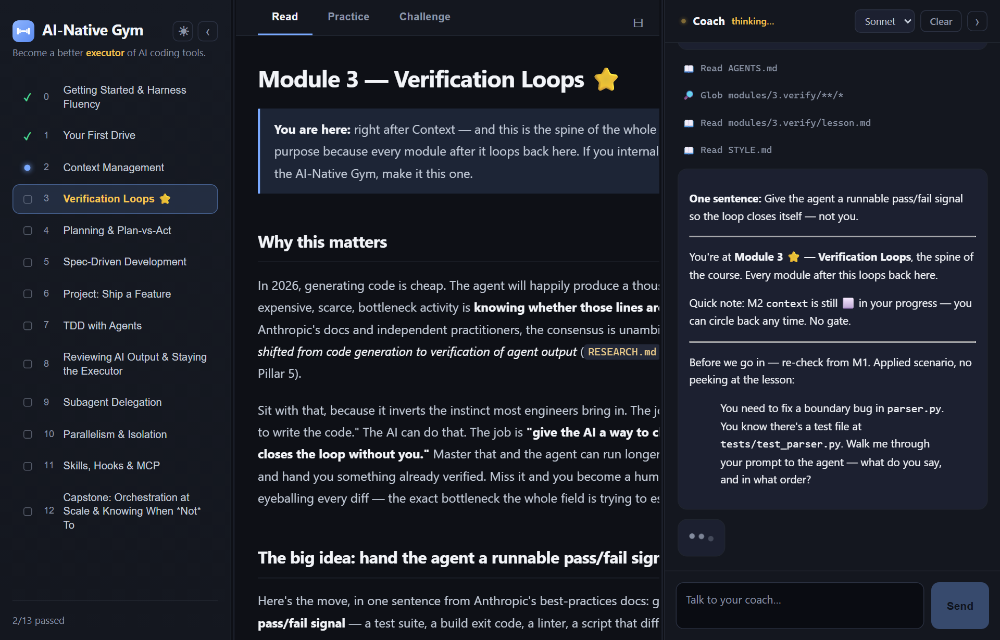
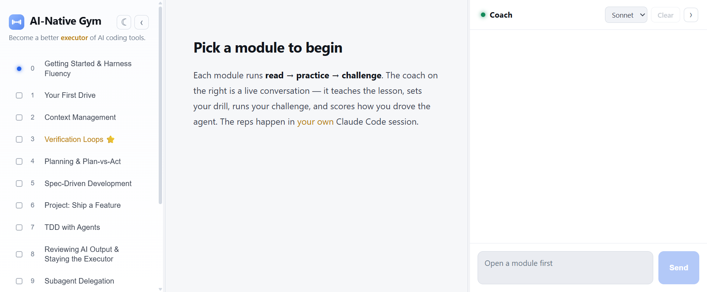
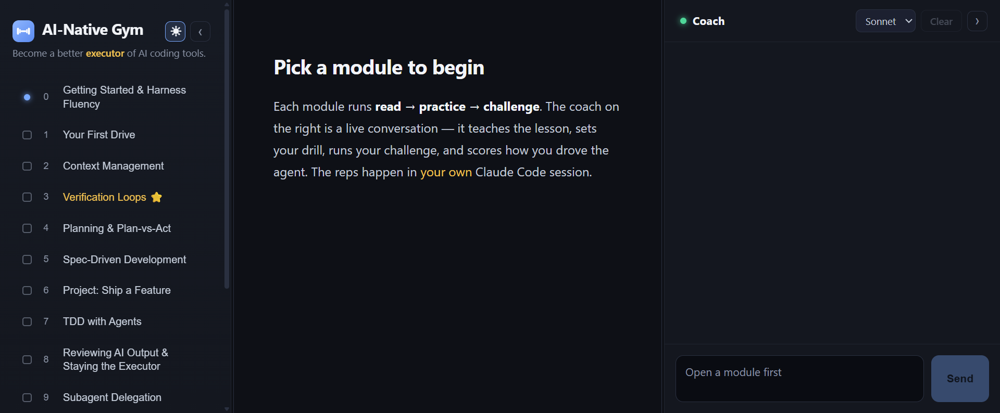
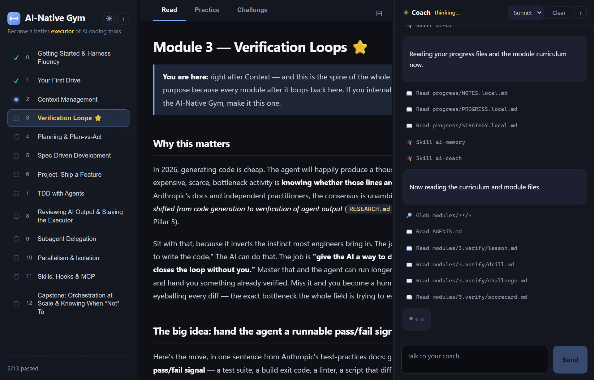
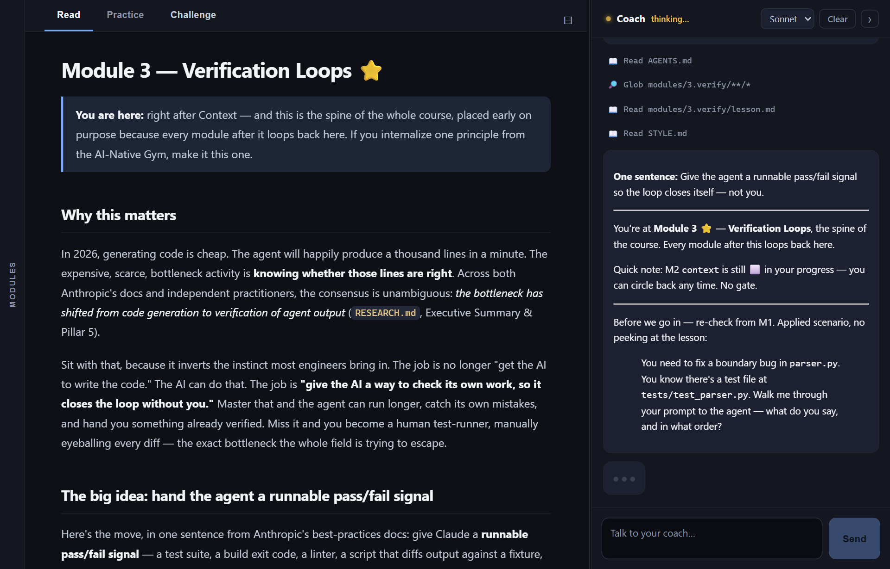

# AI-Native Gym 🏋️

**A trainer that makes you a better *executor* of AI coding tools — delivered as a real app you run.**

<p align="center">
  
  <br>
  <em>The gym, in your browser — the module rail, the live lesson, and your coach, all in one place.</em>
</p>

Most of us picked up AI coding by osmosis — we got fast, but not deliberate. The AI-Native Gym is a
self-paced course that drills the core 2026 workflows (planning, context management, spec-driven
work, **verification loops**, delegation, staying in command) the way you actually learn them:
**by driving a real agent and getting coached on how you drove.**

> **Read this file first.** It's the front door and your orientation. Then run the app (or start a
> terminal session) and the coach takes it from there.

> 🚧 **Status:** in active development, but usable end-to-end today. All 13 modules are authored, and
> the **sandbox proof-of-work** model is live — you do each challenge in your own Claude Code session
> and the coach grades from your **real session transcript**, not your self-report.

---

## Why "AI-native"?

The research is blunt about where 2026 went (see [`RESEARCH.md`](./RESEARCH.md), fully cited): the
bottleneck is no longer *generating* code — it's *verifying* it, and *driving* the agent well. The
dominant failure isn't the model being dumb; it's the model missing context you assumed was obvious.

So "AI-native" isn't about typing faster. It's a handful of habits:

1. **Treat verification, not generation, as the job** — always give the agent a runnable pass/fail signal.
2. **Plan before you act** — but skip the plan when the diff fits in one sentence.
3. **Write the contract, not the wish** — make the implicit explicit before the agent starts.
4. **Engineer context for signal, not volume** — the *right* tokens, not the most.
5. **Delegate with structure, isolate with worktrees** — and know when *not* to.
6. **Match autonomy to the task, and stay the executor** — review with judgment; keep checkpoints.

The gym turns each of these into a module you *practice*, not just read.

---

## Meet the app

The gym ships as a **real web app** — a Bun + **Claude Agent SDK** server with a React 19 / Vite /
Tailwind UI — and it's the front-and-center way to train. Open a module and you get three panes: the
**module rail**, the **lesson / drill / challenge** in the center, and a **live coach** on the right
that streams as it thinks.

<table>
  <tr>
    <td width="50%"></td>
    <td width="50%"></td>
  </tr>
  <tr>
    <td align="center"><em>Light & dark themes…</em></td>
    <td align="center"><em>…one toggle away.</em></td>
  </tr>
  <tr>
    <td width="50%"></td>
    <td width="50%"></td>
  </tr>
  <tr>
    <td align="center"><em>Watch the coach think — live, with tool activity.</em></td>
    <td align="center"><em>Collapse the rails for a focused view.</em></td>
  </tr>
</table>

The app is the **coach surface**: it renders the lesson, the challenge, and your scorecard, and
streams a live [Claude Agent SDK](https://docs.claude.com/en/api/agent-sdk/overview) conversation. It
does **no grading itself** — the coach runs the course, and you still do the graded reps in your
**own** Claude Code session on `sandbox/`. Prefer the terminal? That path works too (see
[Quickstart](#quickstart)).

---

## How it works — read → practice → challenge

Every module follows the same loop:

1. **Read** a short lesson (warm, example-first — see [`STYLE.md`](./STYLE.md)).
2. **Practice** an *ungraded warm-up* on the practice sandbox — small reps, each with a clear pass
   signal. When you finish a rep, the coach reads your session and reviews **how you drove** it.
3. **Challenge** a realistic mission on the sandbox, graded by a **scorecard** on *how you drove the
   agent*: *did you plan? engineer context? delegate well? close a verify loop? stay the executor?*

**You drive the work in your own Claude Code session** on `sandbox/` — a tiny throwaway Python project.
The coach doesn't take your word for what you did: it reads your **session transcript + the sandbox
`git diff`** and grades from the evidence. Two skills do this:

- **`ai-verify`** — the graded **challenge** verifier. Confirms the *proof-of-work floor* (the
  concrete "done when" was really achieved on the sandbox) and grades the five dimensions from evidence.
- **`ai-spot`** — the **warm-up** spotter. Reads your session to coach your *form* on a drill, and
  **never grades** (the warm-up is ungraded by design).

It's **self-paced**. A module is "passed" when the proof-of-work floor is met, your scorecard clears a
lenient bar (≥ 3/5 solid; weak spots are logged as "keep drilling", never blocking), and you've
answered a cold recall question. The coach confirms it with you, then marks it done. Finish all
modules and you get a **graduation reflection** on how you grew and what to keep drilling.

The full rules live in [`AGENTS.md`](./AGENTS.md); the module list in [`CURRICULUM.md`](./CURRICULUM.md).

---

## The curriculum (13 modules, four parts)

Built like a book — **start by doing**, the whole arc in an early exemplar, deep single-idea chapters,
and integration projects:

- **Part I — Getting Started:** `harness` · `first-drive`
- **Part II — The Core Loop:** `context` · **`verify`** ⭐ · `planning` · `spec` · `ship-feature` *(project)*
- **Part III — At Scale & In Command:** `tdd` · `review` · `delegate` · `parallel` · `extend`
- **Part IV — Orchestration & Judgment:** `orchestrate` *(capstone)*

Module 3 (Verification) is the spine — placed early because every later module loops back to it. See
[`CURRICULUM.md`](./CURRICULUM.md) for the principle and lesson **type** behind each.

---

## Quickstart

### Prerequisites

| Tool | Why you need it | Required? |
|---|---|---|
| [Claude Code](https://claude.com/claude-code) | You drive the agent through it — the whole point | **Yes** |
| [Bun](https://bun.sh) | Runtime / test-runner / bundler for the gym web app | **Yes — runs the app** |
| [Python 3](https://www.python.org/) | The sandbox is a stdlib-only Python project; you run `python -m unittest` / `python -m sandbox` (no pip) | **Yes** |
| `git` | The sandbox is its own repo; the coach reads its `git diff` as proof of work | **Yes** |
| [go-task](https://taskfile.dev) | Convenience wrapper for the commands below (every `task X` has a raw fallback) | Optional |

**Auth.** The terminal flow uses your normal Claude Code login. The web app runs a real **Claude Agent
SDK** conversation under the `claude_code` preset, so it authenticates with that **same Claude Code
login** — no separate API key to configure for the documented path. The server listens on `:4600`
(override with the `GYM_PORT` env var).

### 1. Clone

```bash
git clone https://github.com/cicksuy1/ai-native-gym.git
cd ai-native-gym
```

### 2. Create your practice sandbox (once)

```bash
task setup-sandbox    # creates sandbox/ (your practice yard) from the seed, as its own git repo
```

No `task`? Do it by hand:

```bash
cp -r sandbox-seed sandbox && git -C sandbox init -q && git -C sandbox add -A && git -C sandbox commit -q -m baseline
```

### 3. Install & run the app

```bash
task setup      # install gym-app dependencies (Bun)
task app        # build the web client + serve the gym  →  http://localhost:4600
```

No `task`? Run the underlying Bun commands from `gym-app/`:

```bash
cd gym-app && bun install
bun run build:web && bun run app    # build first, THEN serve — the server serves web/dist/
```

Open **http://localhost:4600**, pick a module, and the coach runs the read → practice → challenge
loop. You do each drill and challenge in your **own** Claude Code session on `sandbox/`; the coach
reads what you actually did and coaches/grades how you drove.

### 4. Train in the terminal (alternative)

Prefer a pure terminal flow? Open the folder in Claude Code and say:

```
start the AI gym
```

The `/ai-gym` skill places you at Module 0 and runs the same read → practice → challenge loop — no app
required. The grading and proof-of-work model are identical.

### 5. Verify your install

```bash
task test       # or: cd gym-app && bun test server/   →  88 pass / 0 fail
task typecheck  # optional: type-check the gym-app
```

Hacking on the app itself? `task dev` prints the two-terminal live-dev setup (server on `:4600`,
Vite client on `:4601` with `/api` proxied).

---

## Repo layout

```
ai-native-gym/
├── gym-app/           ← ⭐ the gym web app: Bun + Claude Agent SDK server, React/Vite/Tailwind UI
├── README.md          ← you are here
├── RESEARCH.md        ← the cited research foundation
├── AGENTS.md          ← the authoritative teaching ruleset
├── STYLE.md           ← lesson/voice style guide (Rust-Book-derived)
├── CURRICULUM.md      ← module order + principles
├── Taskfile.yml       ← ops shortcuts (setup, setup-sandbox, app, dev, test, typecheck)
├── .claude/skills/    ← ai-gym, ai-coach, ai-memory, ai-ui, ai-graduation, ai-verify, ai-spot
├── modules/           ← one folder per module ("<n>.<slug>/"): lesson.md + drill.md + challenge.md + scorecard.md
├── sandbox-seed/      ← template for the practice yard (a tiny Python notes CLI); .claude/ ships a
│                        session-export hook so the coach can read your transcript
├── sandbox/           ← your practice yard, provisioned from the seed (gitignored)
├── progress/          ← your private state: PROGRESS/NOTES/STRATEGY .local.md (gitignored)
└── screenshots/       ← the UI captures shown above
```

The app's implementation contract lives in [`gym-app/CONTRACT.md`](./gym-app/CONTRACT.md) — the single
source of truth for every interface the server exposes.

---

## Contributing & collaborating

Contributions are welcome — improvements to lessons, drills, challenges, the skills, or the app.

1. **Fork**, then branch off **`dev`** (the active line). `main` is the released branch; **open PRs
   against `dev`**, not `main`.
2. **Learn the house rules first.** [`AGENTS.md`](./AGENTS.md) is the authoritative teaching ruleset and
   [`STYLE.md`](./STYLE.md) is the voice. Adapt *how* the gym teaches, but **don't water down** the
   scorecard, the proof-of-work floor, or the verify-loop requirement — those are the course.
3. **Before you push:** run `task test` (server suite) and `task typecheck`. Keep changes focused.
4. **Commits:** conventional style — `type: desc` (`feat`, `fix`, `docs`, `refactor`, `test`, `chore`).
5. **Never commit learner-private state.** `progress/*.local.md` and `sandbox/` are gitignored — keep
   them that way; they're personal to each learner and stay on the machine.

Found a teaching gap or a bug in the coach? Open an issue describing the module and what you'd expect —
concrete examples (a transcript snippet, the scorecard you got) help a lot.

---

## Credits

Inspired by the cognitive-tutoring structure of the "Go Gym" and the teaching voice of
*The Rust Programming Language*. Built with Claude Code.

Licensed under the [MIT License](./LICENSE).
